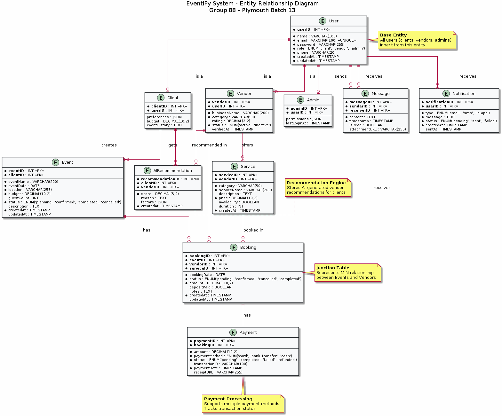

# EventiFy ER Diagram - Quick View

## 📊 Entity Relationship Diagram

This is the complete ER diagram for the EventiFy system as specified in **Section 5.3** of the interim report.

---

## 🖼️ Visual Diagram

*Figure C.1: Entity-Relationship Diagram for EventiFy System*

---

## 📋 Quick Reference

### 11 Entities:
1. **User** (base) - userID, name, email, password, role
2. **Client** (extends User) - preferences, budget
3. **Vendor** (extends User) - businessName, category, rating
4. **Admin** (extends User) - permissions
5. **Event** - eventID, clientID, eventName, date, location, budget
6. **Service** - serviceID, vendorID, category, price
7. **Booking** - bookingID, eventID, vendorID, status, amount
8. **Payment** - paymentID, bookingID, amount, method, status
9. **Message** - messageID, senderID, receiverID, content
10. **AIRecommendation** - recommendationID, clientID, vendorID, score
11. **Notification** - notificationID, userID, type, message

### Key Relationships:
- Client (1) → Event (M)
- Event (M) ↔ Vendor (M) via Booking
- Vendor (1) → Service (M)
- Booking (1) → Payment (1)
- User (M) ↔ User (M) via Message
- Client (M) ↔ Vendor (M) via AIRecommendation

---

## 📚 Full Documentation

For complete details, see:
- **[ER-DIAGRAM-README.md](ER-DIAGRAM-README.md)** - Comprehensive documentation
- **[README.md](README.md)** - Directory index and usage guide

---

## 📥 Download Options

- **PNG:** [EventiFy_ER_Diagram.png](EventiFy_ER_Diagram.png) - For documents (144 KB)
- **SVG:** [EventiFy_ER_Diagram.svg](EventiFy_ER_Diagram.svg) - For high quality (58 KB)
- **PlantUML:** [er-diagram.puml](er-diagram.puml) - Editable source
- **Mermaid:** [er-diagram-mermaid.md](er-diagram-mermaid.md) - GitHub compatible

---

**Project:** EventiFy - Event Management System  
**Group:** Group 88, Plymouth Batch 13  
**Section:** 5.3 ER Diagram (Appendix C)  
**Status:** ✅ Complete
