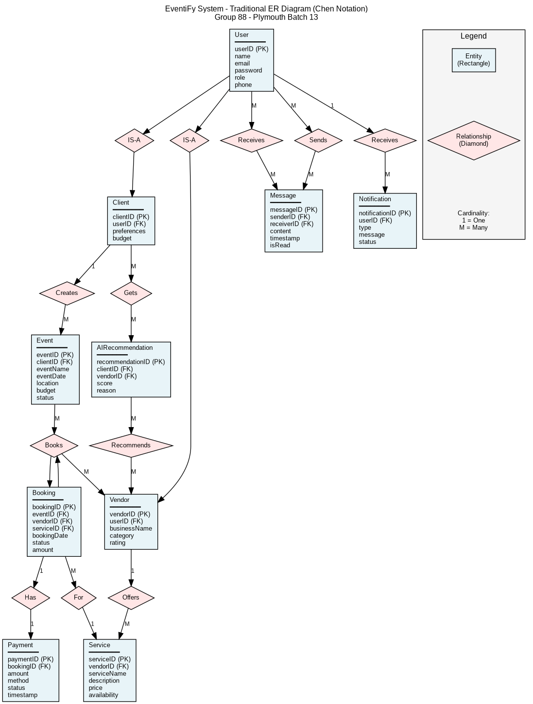

# EventiFy System Diagrams

This directory contains all architectural and design diagrams for the EventiFy project.

## 📊 Available Diagrams

### Appendix C - Entity Relationship (ER) Diagram

The ER Diagram illustrates the complete database structure for the EventiFy system.

**Available in TWO styles:**

#### 1. Traditional Chen Notation (GeeksforGeeks Style) ⭐ NEW
Following traditional ER modeling as taught in database courses:
- 📄 `CHEN-NOTATION-README.md` - Chen notation documentation (9KB)
- 🖼️ `EventiFy_ER_Chen_Notation.png` - Traditional ER diagram (177KB)
- 🎨 `EventiFy_ER_Chen_Notation.svg` - Scalable vector (25KB)
- 📝 `er-diagram-chen.dot` - Graphviz DOT source (editable)

**Quick View:**


#### 2. UML Class Diagram Style (Modern)
Modern software engineering approach:
- 📄 `ER-DIAGRAM-README.md` - Comprehensive documentation (15KB)
- 🖼️ `EventiFy_ER_Diagram.png` - High-quality PNG image (144KB, 1569x1301 px)
- 🎨 `EventiFy_ER_Diagram.svg` - Scalable vector graphic (58KB)
- 📝 `er-diagram.puml` - PlantUML source file (editable)
- 📝 `er-diagram-mermaid.md` - Mermaid diagram (GitHub compatible)

---

## 🗂️ Diagram Details

### ER Diagram (Appendix C)

**Purpose:** Database schema design for EventiFy  
**Entities:** 11 main entities
- User (base entity)
- Client, Vendor, Admin (user types)
- Event
- Service
- Booking
- Payment
- Message
- AIRecommendation
- Notification

**Key Relationships:**
- User (1) → Event (M) via Client
- Event (M) ↔ Vendor (M) via Booking
- Vendor (1) → Service (M)
- Booking (1) → Payment (1)
- User (M) ↔ User (M) via Message
- Client (M) ↔ Vendor (M) via AIRecommendation

**Normalization:** Third Normal Form (3NF)  
**Status:** ✅ Complete and ready for implementation

---

## 📋 Other Diagrams (To Be Added)

### Appendix A - Use Case Diagram
*Coming soon*

### Appendix B - Class Diagram
*Coming soon*

### Appendix D - System Architecture Diagram
*Coming soon*

### Appendix E - Network Diagram
*Coming soon*

---

## 🔧 How to Use These Diagrams

### View in Documentation
- PNG files: Open directly in any image viewer
- SVG files: Open in browser or vector graphics editor
- README files: Open in any markdown viewer

### Edit Diagrams
1. **PlantUML Files (.puml):**
   ```bash
   # Edit the .puml file
   nano er-diagram.puml
   
   # Regenerate PNG
   plantuml -tpng er-diagram.puml
   
   # Regenerate SVG
   plantuml -tsvg er-diagram.puml
   ```

2. **Mermaid Files (.md):**
   - Edit directly in GitHub
   - Preview renders automatically
   - Copy to Mermaid Live Editor for advanced editing

### Include in Reports
- **For Word documents:** Use PNG or SVG files
- **For LaTeX:** Use SVG or PNG
- **For PowerPoint:** Use PNG (higher compatibility)
- **For GitHub/Markdown:** Reference image path or use Mermaid

---

## 📦 File Formats Explained

### PNG (Portable Network Graphics)
- **Pros:** Universal compatibility, high quality
- **Cons:** Fixed resolution, larger file size
- **Best for:** Documents, presentations, printing

### SVG (Scalable Vector Graphics)
- **Pros:** Infinitely scalable, smaller file size
- **Cons:** May not render in all viewers
- **Best for:** Web, high-quality printing, editing

### PlantUML (.puml)
- **Pros:** Text-based, version control friendly, reproducible
- **Cons:** Requires PlantUML to render
- **Best for:** Source control, collaboration, automation

### Mermaid (.md)
- **Pros:** GitHub native, simple syntax, interactive
- **Cons:** Limited styling options
- **Best for:** Documentation, GitHub README files

---

## 🎨 Diagram Style Guide

All diagrams follow consistent styling:
- **Background:** #FEFEFE (off-white)
- **Entity boxes:** #F8F9FA (light gray)
- **Borders:** #212529 (dark gray)
- **Primary Keys:** Bold text
- **Foreign Keys:** Marked with <<FK>>
- **Unique constraints:** Marked with <<UK>>

---

## 📚 Related Documentation

- **Interim Report:** `../Group_88_Interim.md`
- **Section 5.2:** Class Diagram specification
- **Section 5.3:** ER Diagram specification  
- **Section 5.4:** Architecture Diagram specification
- **Chapter 03:** Requirements Specification

---

## 🔄 Update History

| Date | Version | Changes | Author |
|------|---------|---------|--------|
| 2026-02-18 | 1.0 | Initial ER Diagram created | Group 88 |

---

## ✅ Diagram Checklist

- [x] ER Diagram created
- [x] All entities documented
- [x] All relationships defined
- [x] Primary keys identified
- [x] Foreign keys identified
- [x] Normalization verified (3NF)
- [x] PNG image generated
- [x] SVG image generated
- [x] Documentation complete
- [ ] Use Case Diagram (Appendix A)
- [ ] Class Diagram (Appendix B)
- [ ] Architecture Diagram (Appendix D)
- [ ] Network Diagram (Appendix E)

---

## 💡 Tips

1. **Viewing Large Diagrams:** Use zoom function in image viewers
2. **Printing:** Use SVG for best quality
3. **Presentations:** Use PNG for compatibility
4. **Editing:** Modify .puml file and regenerate
5. **GitHub Preview:** Mermaid diagrams render automatically

---

## 📧 Contact

For questions about the diagrams:
- **System Architect:** Ranasinghe Silva (10967220)
- **Database Lead:** Mudannayakage Mudannayaka (10967384)
- **Documentation Lead:** Danapala Bandara (10967195)

---

**Last Updated:** 18th February 2026  
**Status:** ER Diagram Complete ✅  
**Next:** Use Case Diagram (Appendix A)
