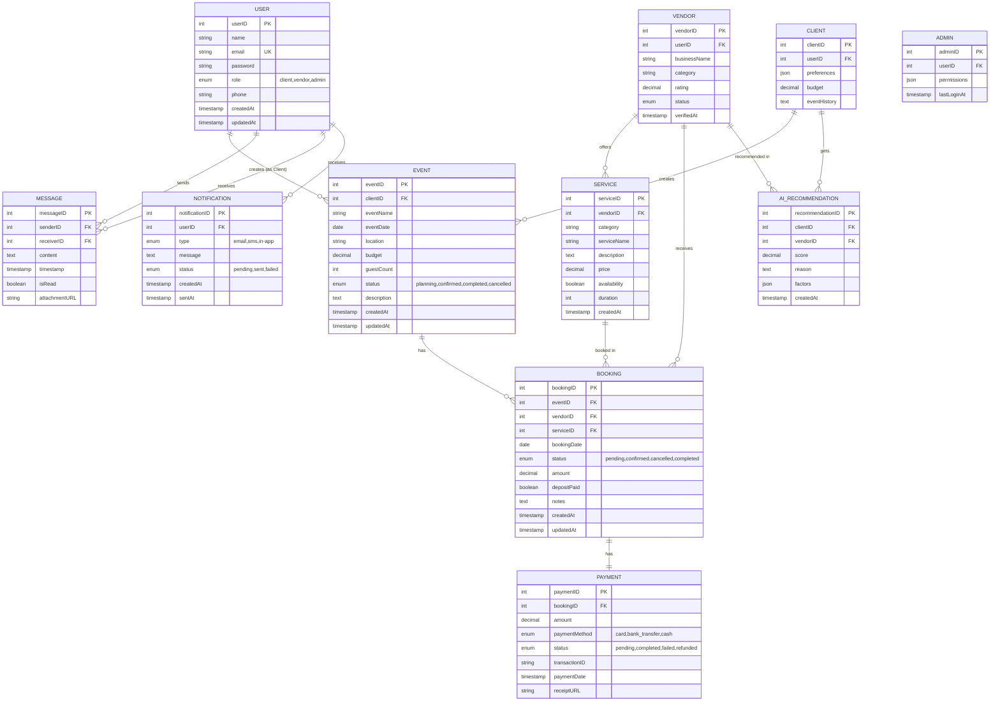

```mermaid
erDiagram
    USER ||--o{ EVENT : "creates (as Client)"
    USER ||--o{ MESSAGE : "sends"
    USER ||--o{ MESSAGE : "receives"
    USER ||--o{ NOTIFICATION : "receives"
    
    CLIENT ||--o{ EVENT : "creates"
    CLIENT ||--o{ AI_RECOMMENDATION : "gets"
    
    VENDOR ||--o{ SERVICE : "offers"
    VENDOR ||--o{ BOOKING : "receives"
    VENDOR ||--o{ AI_RECOMMENDATION : "recommended in"
    
    EVENT ||--o{ BOOKING : "has"
    
    SERVICE ||--o{ BOOKING : "booked in"
    
    BOOKING ||--|| PAYMENT : "has"
    
    USER {
        int userID PK
        string name
        string email UK
        string password
        enum role "client,vendor,admin"
        string phone
        timestamp createdAt
        timestamp updatedAt
    }
    
    CLIENT {
        int clientID PK
        int userID FK
        json preferences
        decimal budget
        text eventHistory
    }
    
    VENDOR {
        int vendorID PK
        int userID FK
        string businessName
        string category
        decimal rating
        enum status
        timestamp verifiedAt
    }
    
    ADMIN {
        int adminID PK
        int userID FK
        json permissions
        timestamp lastLoginAt
    }
    
    EVENT {
        int eventID PK
        int clientID FK
        string eventName
        date eventDate
        string location
        decimal budget
        int guestCount
        enum status "planning,confirmed,completed,cancelled"
        text description
        timestamp createdAt
        timestamp updatedAt
    }
    
    SERVICE {
        int serviceID PK
        int vendorID FK
        string category
        string serviceName
        text description
        decimal price
        boolean availability
        int duration
        timestamp createdAt
    }
    
    BOOKING {
        int bookingID PK
        int eventID FK
        int vendorID FK
        int serviceID FK
        date bookingDate
        enum status "pending,confirmed,cancelled,completed"
        decimal amount
        boolean depositPaid
        text notes
        timestamp createdAt
        timestamp updatedAt
    }
    
    PAYMENT {
        int paymentID PK
        int bookingID FK
        decimal amount
        enum paymentMethod "card,bank_transfer,cash"
        enum status "pending,completed,failed,refunded"
        string transactionID
        timestamp paymentDate
        string receiptURL
    }
    
    MESSAGE {
        int messageID PK
        int senderID FK
        int receiverID FK
        text content
        timestamp timestamp
        boolean isRead
        string attachmentURL
    }
    
    AI_RECOMMENDATION {
        int recommendationID PK
        int clientID FK
        int vendorID FK
        decimal score
        text reason
        json factors
        timestamp createdAt
    }
    
    NOTIFICATION {
        int notificationID PK
        int userID FK
        enum type "email,sms,in-app"
        text message
        enum status "pending,sent,failed"
        timestamp createdAt
        timestamp sentAt
    }
```
